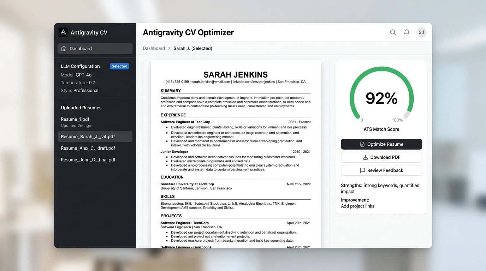

# Antigravity CV Optimizer

A privacy-first, client-side web application designed to customize and optimize resumes for ATS compatibility and human readability using LLMs. It generates a customized, professional CV and cover letter based on uploaded career history and a target Job Description.



## Features

- **Apple-Inspired Design**: Crisp, clean light mode default styling with dark mode toggles.
- **Collapsible Sidebar**: Compact left configuration menu to maximize your workspace real estate.
- **Strict 2-Page Layout**: System prompts specifically constraint the resume to fit neatly within 2 pages, focusing on high-impact accomplishments and metrics.
- **Replicated Resume Styling**:
  - Centered header (name, title, and contact links).
  - Contact row with custom inline vector icons (Email, Phone, Location, LinkedIn).
  - Double horizontal borders flanking section headers.
  - Right-aligned dates and locations.
  - Justified text alignments.
  - Balanced 2-column skills grids.
- **Recruiter-Friendly Cover Letter**: Generates a punchy, summarized cover letter (under 250 words) to help hiring managers quickly shortlist your application.
- **Private & Local-First**: Runs entirely client-side. Your uploaded CVs, LLM configurations, and API keys are stored only in your local browser `localStorage`. No data is sent to intermediate servers.

## Tech Stack

- **Framework**: React 19 + TypeScript + Vite 8
- **Styling**: Vanilla CSS (no heavy utility frameworks)
- **PDF Extraction**: `pdfjs-dist` (client-side dynamic import chunk)
- **Icons**: `lucide-react`

## Quick Start

### Installation

Clone the repository and install the dependencies:

```bash
npm install
```

### Development Server

Run the local development server:

```bash
npm run dev
```

Open [http://localhost:5173/](http://localhost:5173/) in your web browser.

### Production Build

To generate the static assets for hosting:

```bash
npm run build
```

This will build the app and place the static files in the `dist/` directory, which can be uploaded to GitHub Pages, Netlify, Vercel, or any personal web host.
